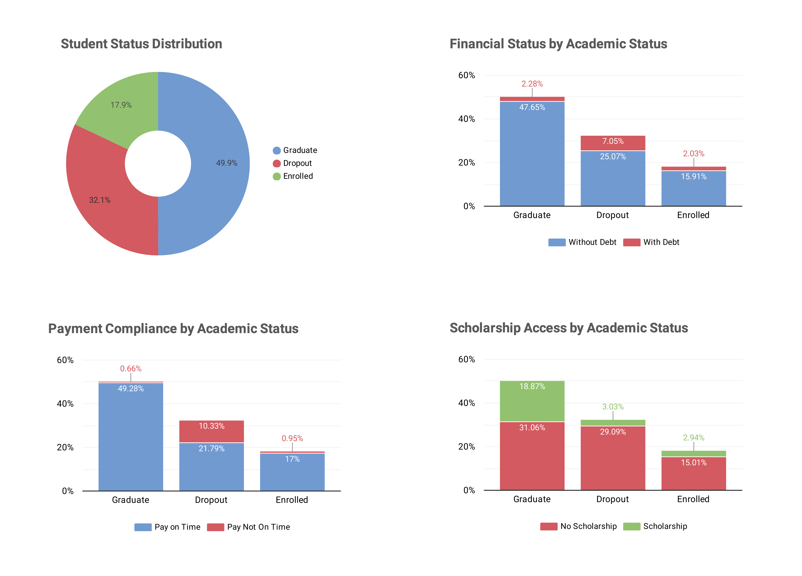
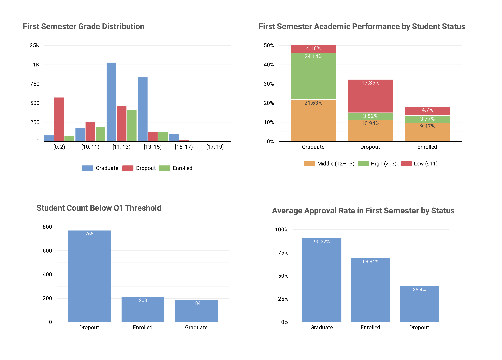
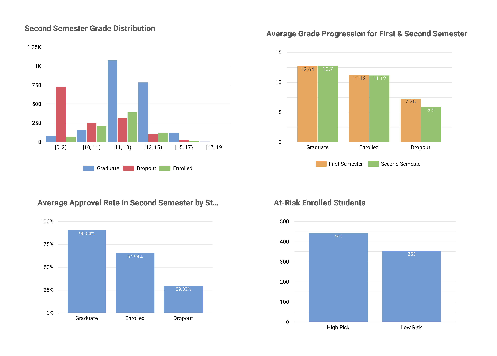
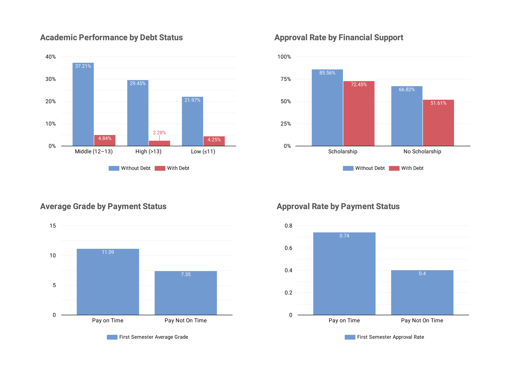

# Student Dropout Predictor

## Business Understanding
Jaya Jaya Institut merupakan salah satu institusi pendidikan perguruan yang telah berdiri sejak tahun 2000. Hingga saat ini ia telah mencetak banyak lulusan dengan reputasi yang sangat baik. Namun, di balik keberhasilan tersebut, terdapat tantangan signifikan yaitu tingginya angka mahasiswa yang tidak menyelesaikan studi (_dropout_).

Jumlah _dropout_ yang tinggi ini tentunya menjadi salah satu masalah yang besar untuk sebuah institusi pendidikan. Oleh karena itu, Jaya Jaya Institut membutuhkan sistem _early warning_ yang mampu mengidentifikasi mahasiswa berisiko sejak awal masa studi, sehingga intervensi dini dapat dilakukan untuk meningkatkan retensi dan kelulusan.

### Permasalahan Bisnis
Berikut adalah permasalahan bisnis yang akan diselesaikan.

1. Tingginya angka _dropout_ yang mengganggu kinerja institusi dan reputasi jangka panjang.
2. Kurangnya mekanisme deteksi dini terhadap mahasiswa yang berpotensi _dropout_, sehingga intervensi sering terlambat atau tidak tepat sasaran.
3. Sulitnya memahami faktor risiko yang memengaruhi potensi mahasiswa melakukan _dropout_, seperti performa akademik rendah di semester awal, masalah finansial, kurangnya dukungan akademik dan motivasi.
4. Keterbatasan staf akademik dalam memantau perkembangan mahasiswa secara manual tanpa alat bantu berbasis data.

### Cakupan Proyek
Beberapa cakupan proyek yang akan dikerjakan yaitu meliputi:
1. Analisis terhadap dataset siswa untuk mengidentifikasi pola dan faktor yang berkorelasi dengan risiko _dropout_.
2. Pembuatan _dashboard_ interaktif menggunakan Looker Studio untuk membantu tim akademik dalam memahami faktor pengaruh terhadap risiko _dropout_ seperti:
    - Gambaran umum status akademik & kondisi finansial,
    - Analisis performa akademik Semester 1,
    - Pemantauan perkembangan Semester 2 & identifikasi _early warning_,
    - Eksplorasi hubungan antara faktor finansial dan hasil akademik.
3. Membuat sistem prediksi risiko _dropout_ menggunakan _machine learning_ (_Random Forest_ dengan _threshold_ 0.37) dan diimplementasikan sebagai _website_ interaktif menggunakan Streamlit. Sistem ini menghasilkan prediksi dalam tiga kategori yaitu tidak berisiko _dropout_, mulai berisiko _dropout_, dan berisiko tinggi _dropout_. _Prototype_ telah di _deploy_ ke Streamlit Community Cloud dan dapat diakses publik.
4. Memberikan rekomendasi action items yang dapat dilakukan. 

### Persiapan

#### Sumber Data : [Dataset Performa Siswa Jaya Jaya Institut](https://github.com/dicodingacademy/dicoding_dataset/tree/main/students_performance)

#### Setup Environment

##### 1. Opsi 1 : Menggunakan Anaconda
```bash
conda create --name main-ds python=3.9
conda activate main-ds
pip install -r requirements.txt
```

##### 2. Opsi 2 : Menggunakan Shell/Terminal
```bash
pip install pipenv
pipenv --python 3.9
pipenv install -r requirements.txt
pipenv shell
```

## Business Dashboard
Dalam membantu Jaya Jaya Institut untuk memahami mahasiswanya lebih lanjut dan mencegah _dropout_, dibuatlah visualisasi _dashboard_ yang dapat diakses melalui : [Student Early Warning Dashboard](https://lookerstudio.google.com/reporting/89ec4c6c-496a-4cf9-b904-a2b248473203).

_Dashboard_ terdiri dari 4 halaman yang mengeksplorasi dimensi demografi, performa akademik, faktor finansial, dan sinyal _early warning_.

### 1. Student Overview & Financial Status
Halaman pertama memberikan gambaran utama mengenai persebaran populasi mahasiswa berdasarkan status akademiknya yaitu _graduate_, _dropout_, dan _enrolled_ serta kondisi finansial mereka. Dari 49.9% mahasiswa yang lulus, hanya 2.28% yang memiliki hutang serta 0.66% telat membayar. Artinya, sebagian lulusan berhasil menyelesaikan studi tanpa beban finansial. Sebaliknya, di kelompok _dropout_, 7.05% memiliki hutang serta 10.33% telat membayar. Persentase tersebut merupakan yang paling tinggi diantara kedua status lainnya, ini membuktikan bahwa finansial bisa menjadi salah satu faktor _dropout_. Kemudian, penerima beasiswa yang tinggi pada kelompok yang lulus juga memperkuat pentingnya dukungan finansial dalam mendukung keberhasilan akademik.


### 2. First Semester Academic Performance
Halaman kedua menunjukkan performa akademik di semester pertama yang dimana menjadi dasar awal untuk memprediksi risiko _dropout_. Distribusi nilai menunjukkan bahwa sebagian besar _dropout_ berkonsentrasi di rentang nilai rendah (0–2 dan 11–13), sementara lulusan dominan di rentang tinggi (11–13). Lebih dari 17% atau setara dengan 768 mahasiswa yang _dropout_ memiliki nilai rendah yaitu dibawah 11. Kemudian mereka yang lulus memiliki nilai berada diatas 13 yaitu sebesar 24.14% dan hanya 184 mahasiswa saja yang memiliki nilai dibawah 11. Dari segi _approval rate_ (rasio mata kuliah yang lulus terhadap yang diambil) yaitu kategori memiliki nilai 38.4% dan merupakan yang paling kecil daripada kategori _enrolled_ dan _graduate_. Ini menunjukkan bahwa mahasiswa yang berisiko tidak hanya memiliki nilai rendah, tetapi juga kesulitan menyelesaikan mata kuliah yang mereka ambil.


### 3. Second Semester Academic Progress & Early Warning Signals
Halaman ketiga mengevaluasi perkembangan akademik di semester kedua untuk melihat apakah mahasiswa mampu beradaptasi dan meningkatkan performa. Hasilnya menunjukkan bahwa sebagian besar mahasiswa _dropout_ tidak mengalami perbaikan, dapat dilihat rata-rata nilai mereka turun dari 7.26 menjadi 5.9, dan _approval rate_ menurun drastis menjadi 29.33%. Ini kemungkinan karena banyak yang sudah mengundurkan diri sebelum menyelesaikan semester kedua. Selanjutnya kategori _enrolled_, dibagi menjadi siswa berisiko rendah dan tinggi. Mereka yang memiliki nilai dibawah 11 dan approval rate yang rendah serta telat membayar memiliki risiko terkena _dropout_. Dan ada sebanyak 441 mahasiswa yang memiliki risiko tinggi terkena _dropout_, sehingga perlu adanya langkah intervensi untuk mencegah risiko _dropout_ tersebut.


### 4. Financial Factors & Academic Outcome
Halaman terakhir mengonfirmasi bahwa faktor finansial memiliki korelasi kuat dengan hasil akademik. Mahasiswa yang memilik hutang jauh lebih mungkin memiliki nilai akdemik yang rendah yaitu sebesar 4.25%. Efisiensi akademik juga terbukti dipengaruhi oleh dukungan finansial seperti mahasiswa yang mendapat beasiswa dan tidak memiliki hutang memiliki _approval rate_ tertinggi yaitu 85.56%, sementara kategori sebaliknya yaitu hanya 51.61%. Siswa yang telat membayar juga memiliki rata-rata nilai lebih rendah dibandingkan dengan yang bayar tepat waktu. begitu juga dengan approval ratenya. Ini memperkuat bukti bahwa tekanan finansial dapat menghambat proses akademik mahasiswa.


## Menjalankan Sistem Machine Learning
Sistem prediksi risiko _dropout_ telah dikembangkan sebagai aplikasi web interaktif menggunakan Streamlit, sehingga lebih mudah digunakan oleh pihak institusi tanpa memerlukan pengetahuan teknis. Ada beberapa cara untuk mengakses website tersebut yaitu:

### 1. Menjalankan secara lokal
Setelah _environment_ diaktifkan dan dependensi terinstal, jalankan perintah berikut di terminal:
```
streamlit run app.py
```

### 2. Mengakses versi online
_Protoype_ sistem _machine learning_ yang dibuat dapat diakses secara publik melalui tautan berikut: [Student Dropout Predictor](https://student-dropout-predictor-3p5kbebm6maandhfdfqupa.streamlit.app/)

### Cara Menggunakan Aplikasi

Setelah membuka _website_, ada beberapa data mahasiswa yang harus diisi, antara lain:
- Usia
- Jenis kelamin
- Status pernikahan
- Kondisi finansial (hutang, beasiswa, pembayaran tepat waktu)
- Jumlah mata kuliah diambil & lulus
- Rata-rata nilai Semester 1.
- Jumlah mata kuliah yang diambil tetapi tidak mengikuti ujiannya.

Kemudian, klik tombol `“🔍 Prediksi Risiko Dropout”` untuk melihat hasil prediksi mahasiswa. Sistem akan menampilkan hasil prediksi dalam 3 kategori, yaitu:
- Tidak Berisiko Dropout (probabilitas < 0.68)
- Mulai Berisiko Dropout (0.37 ≤ probabilitas < 0.68)
- Berisiko Tinggi Dropout (probabilitas ≥ 0.75).

Dan setiap hasil disertai dengan rekomendasi tindakan berdasarkan tingkat risikonya.

## Conclusion
Berdasarkan hasil _Exploratory Data Analysis_ (EDA) dan pemodelan _machine learning_, proyek ini berhasil mengidentifikasi karakteristik utama mahasiswa yang berpotensi mengalami _dropout_ di Jaya Jaya Institut. Proyek ini juga berhasil mengembangkan sebuah _early warning system_ berbasis data untuk mengidentifikasi mahasiswa berisiko _dropout_ sejak awal masa studi mereka. 

Hasil analisis menunjukkan bahwa risiko _dropout_ tidak disebabkan oleh satu faktor tunggal, melainkan kombinasi antara performa akademik awal dan kondisi finansial mahasiswa. Mahasiswa dengan karakteristik berikut memiliki kecenderungan risiko dropout yang lebih tinggi:

1. Mahasiswa dengan _approval rate_ (rasio mata kuliah yang lulus terhadap yang diambil) pada semester 1 yang rendah, khususnya di bawah 70%, yang mengindikasikan kesulitan akademik sejak awal masa studi.
2. Mahasiswa dengan nilai rata-rata Semester 1 yang rendah (di bawah ambang batas kelulusan ideal), yang mencerminkan kurangnya kesiapan akademik atau adaptasi terhadap lingkungan perkuliahan.
3. Mahasiswa yang memiliki mata kuliah tanpa evaluasi, yang dapat menjadi indikator ketidakhadiran atau kurangnya partisipasi saat ujian diadakan.
4. Mahasiswa dengan risiko finansial, seperti memiliki tunggakan atau keterlambatan pembayaran dan memiliki utang, terutama ketika kondisi tersebut terjadi bersamaan dengan performa akademik yang rendah terbukti memiliki pengaruh terhadap potensi _dropout_ dibandingkan masing-masing faktor secara terpisah.
5. Mahasiswa penerima beasiswa cenderung memiliki risiko _dropout_ yang lebih rendah dibandingkan mahasiswa tanpa bantuan finansial. Namun, hal ini menunjukkan bahwa beasiswa bersifat protektif secara finansial dan tidak sepenuhnya mengeliminasi risiko _dropout_, terutama apabila mahasiswa tetap mengalami penurunan performa akademik.

Temuan ini menunjukkan bahwa mahasiswa dengan masalah finansial tidak selalu langsung berisiko _dropout_, namun risiko meningkat signifikan ketika masalah finansial tersebut disertai dengan penurunan performa akademik. Hal ini mengindikasikan pentingnya pendekatan intervensi yang mempertimbangkan kondisi akademik dan finansial secara bersamaan.

### Rekomendasi Action Items
Berdasarkan dari temuan analisis yang dilakukan, berikut adalah rekomendasi tindakan konkret yang dapat diimplementasikan oleh institusi:

1. Mengidentifikasi dan memprioritaskan mahasiswa yang masih terdaftar (_enrolled_) namun telah menunjukkan tanda-tanda risiko, seperti nilai Semester 1 di bawah 11, _approval rate_ kurang dari 70%, memiliki utang, atau mengalami keterlambatan pembayaran. Pendekatan personal dapat dilakukan melalui konseling akademik, penyesuaian beban mata kuliah, atau pemberian bantuan finansial darurat.
2. Memperluas akses bantuan tunjangan finansial, terutama bagi mahasiswa dari latar belakang ekonomi menengah ke bawah. Selain itu, membangun sistem notifikasi otomatis bagi mahasiswa yang terlambat membayar, serta menyediakan opsi cicilan atau keringanan pembayaran.
3. Membangun sistem deteksi risiko otomatis untuk mengidentifikasi mahasiswa dengan performa akademik rendah sejak awal semester, sehingga intervensi dapat dilakukan lebih cepat dan efektif.
4. Menciptakan lingkungan belajar yang saling mendukung, seperti pembentukan klub belajar atau tutor untuk kelompok mahasiswa yang nilai akademiknya kurang.
5. Menyediakan dan memberikan sesi konsultasi akademik kepada mahasiswa secara rutin pada awal setiap semester untuk membantu mahasiswa meninjau dan merencanakan mata kuliah yang sesuai dengan kemampuan dan kondisi mereka.
